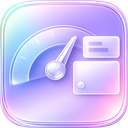
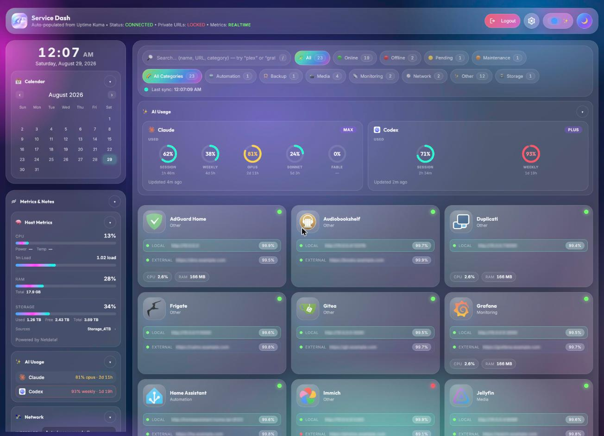
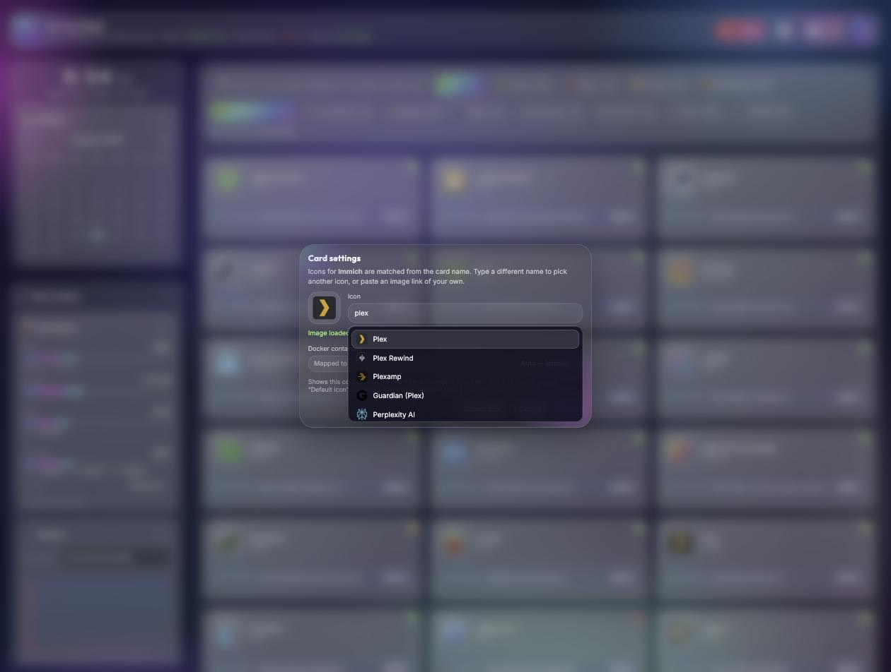
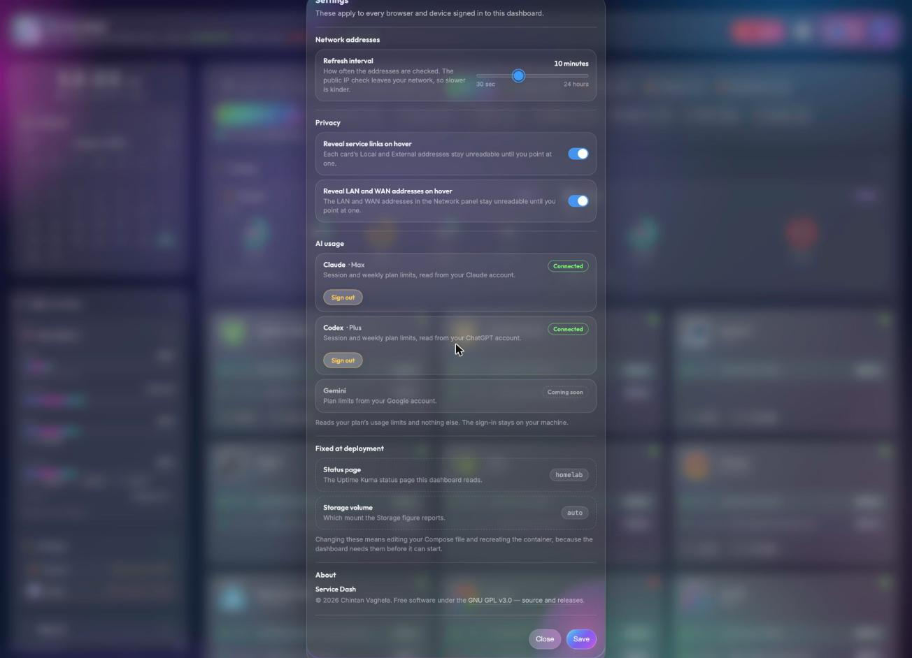
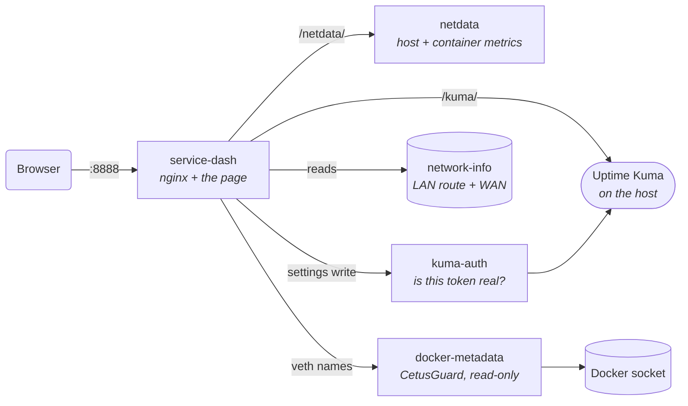

<div align="center">



# Service Dash

**A homelab dashboard that turns your Uptime Kuma status page into a live view of your services — and the machine running them.**

[](https://github.com/cvaghela/service-dash/actions/workflows/validate.yml)
[](https://github.com/cvaghela/service-dash/releases/latest)
[](LICENSE)
[](https://github.com/cvaghela/service-dash/pkgs/container/service-dash)
[](#requirements)

[Quick start](#quick-start) · [Configuration](#configuration) · [How it works](#how-it-works) · [Troubleshooting](#troubleshooting)



</div>

---

## Why

Uptime Kuma tells you whether a service is up. It does not tell you what the box is doing, where the service actually
lives, or how much of your RAM that one container is eating. Service Dash puts all of that on one page.

It is one Compose stack — the dashboard, a bundled Netdata Agent, and three small sidecars. No build step, no Node.js
runtime, no separate Netdata install. nginx serves the page and proxies everything else, so the browser only ever talks
to one origin.

## Features

|  | |
| --- | --- |
| **Live service cards** | Status, uptime and both endpoints for every monitor on your Kuma status page. Search, filter by status or category, and click a card to open it. |
| **Real host metrics** | CPU with normalised load, RAM, storage, and network throughput from a bundled Netdata Agent — plus package power and temperature where the hardware exposes them. |
| **Per-container CPU and RAM** | Map a card to one container or several; an app plus its database, cache and worker are added together into one figure. |
| **Real service icons** | Automatic matching against the full [selfh.st](https://github.com/selfhst/icons) catalogue — 2,880 icons and growing — with a live picker per card. No internet? Every card falls back to a monogram drawn in the browser. |
| **Settings that follow you, with no second account** | Card icons, container mappings, filters, storage selection and notes are shared by every browser and device — kept on the server, not in one browser's storage. Reading them is open; changing anything asks Uptime Kuma whether your session is real, so there is no separate login to create. |
| **Private by default** | Service URLs and the host's own LAN and WAN addresses are withheld until you sign in, so the dashboard can sit on a screen other people can see. |
| **Offline-tolerant** | Fonts, icons and the icon catalogue all degrade to local fallbacks. Nothing on the page depends on reaching the internet. |

<div align="center">


</div>

---

## Requirements

- Linux **AMD64** host — the published images are `linux/amd64` only
- **Docker Engine with Compose v2**, running **rootful**
- An **Uptime Kuma** instance on the same host, with its HTTP port published
- Outbound HTTPS and DNS — needed only for WAN-address detection and the icon catalogue

Rootful is not a preference. The bundled Netdata Agent runs with `pid: host`, `SYS_PTRACE` and `SYS_ADMIN`, an
unconfined AppArmor profile and read-only mounts of the host root, `/proc` and `/sys`; the network helper uses host
networking to read the default route. Those are what produce real host metrics, and rootless Docker cannot grant them.
Nothing else in the stack is privileged — the dashboard itself asks for nothing, and the Docker socket goes only to
CetusGuard, restricted to read-only network queries.

<details>
<summary><strong>Platform support</strong></summary>

<br>

| Platform | Support | Why |
| --- | --- | --- |
| ZimaOS on ZimaBoard | **Supported** | The primary target, and where releases are tested |
| CasaOS on Linux AMD64 | **Supported** | Use `docker-compose.casaos.yml`; take it from the release rather than adapting the standard file |
| Debian / Ubuntu AMD64 | **Supported** | Stock Docker Engine, nothing special needed |
| Other Linux AMD64 | Best effort | AppArmor, SELinux or mount policy may need adjusting for the Netdata Agent |
| Synology / QNAP | Best effort | Vendor Docker builds often withhold `pid: host` and the capabilities Netdata needs |
| Linux ARM64 | Not yet | Images are built `linux/amd64` only — the stack has no ARM-specific blocker, the images simply are not published |
| Docker Desktop (macOS / Windows) | Not supported | Containers would measure Docker's Linux VM, not your machine, so host metrics would be fiction |
| Rootless Docker | Not supported | Cannot grant `pid: host`, `SYS_ADMIN` or the host mounts Netdata needs |
| Podman / Kubernetes | Not supported | The stack is written for Docker Compose; neither is tested |

</details>

---

## Quick start

```sh
mkdir -p /opt/service-dash && cd /opt/service-dash
curl -fsSLO https://raw.githubusercontent.com/cvaghela/service-dash/main/docker-compose.yml
docker compose pull && docker compose up -d
```

Open **`http://SERVER-IP:8888`**.

Every release publishes both Compose files as assets — take the one that matches your host.

<details>
<summary><strong>ZimaOS</strong></summary>

<br>

Enable **SSH Access** from the ZimaOS View menu, then:

```sh
sudo -i
mkdir -p /DATA/AppData/service-dash && cd /DATA/AppData/service-dash
curl -fsSLO https://raw.githubusercontent.com/cvaghela/service-dash/main/docker-compose.yml
export DOCKER_CONFIG=/var/lib/docker/.docker && mkdir -p "$DOCKER_CONFIG"
docker compose pull && docker compose up -d
```

Keep the file in that directory so the stack can be updated later. The `x-casaos` block supplies the ZimaOS tile
metadata; other Compose implementations ignore it.

</details>

<details>
<summary><strong>CasaOS</strong></summary>

<br>

CasaOS needs **`docker-compose.casaos.yml`** — do not import the standard file. Its UI importer does not reliably keep
named volumes or the default network, so the CasaOS file uses explicit `/DATA/AppData/service-dash` bind mounts and a
named bridge network with service aliases.

**App Store → Custom Install → Docker Compose**, paste the file, install, then open `http://CASAOS-IP:8888`.

</details>

<details>
<summary><strong>From a source checkout</strong></summary>

<br>

`install-linux.sh` runs the same deployment plus platform, Compose, Netdata, network and Uptime Kuma checks:

```sh
chmod +x install-linux.sh && ./install-linux.sh
```

</details>

---

## Configuration

Everything is set in the Compose file. There is no `.env`, and **no Uptime Kuma credentials belong in it** — signing in
is a browser-only action.

| Setting | Service | Purpose | Default |
| --- | --- | --- | --- |
| `ports` | service-dash | Host port mapped to container port 80 | `8888:80` |
| `KUMA_PORT` | service-dash | HTTP port Uptime Kuma publishes on this host | `3001` |
| `STATUS_SLUG` | service-dash | Last path segment of your published status-page URL | `homelab` |
| `STORAGE_MOUNT` | service-dash | Initial storage source for a browser with no saved choice | `auto` |
| `KUMA_URL` | kuma-auth | Where the validator reaches Kuma. Must be the same instance as `KUMA_PORT` | `http://host.docker.internal:3001` |
| `NETWORK_INFO_REFRESH_SECONDS` | network-info | Starting value only — the Settings page overrides it | `600` |

`KUMA_PORT` is a port number, not a URL: for `http://SERVER:3010` use `3010`. Kuma must be on the same host — a remote
instance, an HTTPS-only Kuma, or one behind a path prefix is not supported by the current Compose file.

To find your slug, open the published status page in Kuma: a URL ending `/status/homelab` means `STATUS_SLUG: "homelab"`.

After editing Compose, recreate the affected container:

```sh
docker compose up -d --force-recreate service-dash
```

### The Settings page

The gear in the top bar — visible once you are signed in — holds what does **not** need a container recreated:

- **Refresh interval** — how often the LAN route and public IP are re-read, from 30 seconds to 24 hours.
- **Reveal service links on hover** — whether card links stay unreadable until pointed at.
- **Reveal LAN and WAN addresses on hover** — the same, for the host's own addresses.

These apply to every browser and device. `network-info` reads the interval straight from the shared document and picks
it up on its next pass; if it is missing or out of range it falls back to `NETWORK_INFO_REFRESH_SECONDS`, then 600.

`KUMA_PORT`, `STATUS_SLUG` and `STORAGE_MOUNT` stay in Compose, because the dashboard needs them before it can start.

### Shared settings and sign-in

Card settings, filters, storage and network selections and the notes panel are shared by every browser and device.
There is nothing to switch on and no password to set: **reading is open; saving requires being signed in to Uptime
Kuma.**

nginx cannot verify a Kuma token, and a browser claiming to be signed in proves nothing, so the question is put to Kuma
itself. The `kuma-auth` sidecar emits Kuma's `loginByToken`, which checks the token against Kuma's own secret, confirms
the user is still active, and rejects tokens issued before a password change. Anything that is not an explicit yes is a
no — including a timeout. The token stays in the browser that signed in and is never written into the shared document.

<details>
<summary><strong>What that means in practice</strong></summary>

<br>

- Anyone who can reach the dashboard can **read** the settings, as they can already read the dashboard.
- Anyone who can sign in to your Uptime Kuma can **change** them for everyone. Kuma's user list is the guest list.
- **Last write wins** — no merge, no locking. Changes elsewhere appear on reload, not live.
- If `kuma-auth` is down the shared document becomes unavailable **including reads**: nginx checks every request to it
  and cannot be made to check only writes. Each browser falls back to its own copy and the dashboard keeps working.
- The document is capped at 256 KB. A failed write leaves that browser on its own copy with one warning.

</details>

### What signing in reveals

Signed out, service links and the host's LAN and WAN addresses read **URL Locked** and **IP Locked**. Those values are
never requested, so they do not reach the browser at all.

Signed in, they are shown — by default staying unreadable until you point at one or tab to it, so the dashboard can sit
on a visible screen. Both covers can be turned off in Settings. The Settings gear is hidden while signed out, and notes
are locked the same way.

---

## Using the dashboard

**Service cards** show each service's two endpoints, Local and External. The one a click will open is tinted; the
Local/External switch in the top bar moves that highlight. A service with one endpoint shows one row.

**Card settings** — hover a card, click the pencil on its icon:

- **Icon** — type a service name to search the full selfh.st catalogue, or paste an image link. **Default icon**
  restores the automatic match; clearing the field shows a monogram.
- **Mapped to** — which containers' CPU and RAM the card shows. Kuma monitor names and container names rarely agree, so
  most cards need pointing at their container once. Map several and their figures are added together, with the tooltip
  naming what was combined. A container that stops reporting is left out rather than counted as zero.

**Host metrics** come from the bundled Netdata Agent: CPU utilisation with normalised 1-minute load (`32% (1.28 / 4)`),
RAM, storage with used/free/total, and network throughput. Package power and temperature appear where the host exposes
Intel RAPL and sensor feeds; missing optional sensors show `—` rather than invented values.

<details>
<summary><strong>Storage sources</strong></summary>

<br>

Auto-detection prefers named data disks — `/media/…`, `/DATA`, CasaOS data storage, `/mnt`, then `/` — and excludes boot
partitions, container overlays and transient system mounts. Open the Storage card's **Sources** dropdown to pick one or
several; multiple selections are converted to bytes and aggregated. Take care not to select two paths backed by the same
filesystem, or it is counted twice. The choice is saved per browser and beats `STORAGE_MOUNT`.

`STORAGE_MOUNT` takes `auto` or one exact mount path — a `chart_labels.mount_point` value such as `/DATA`, not a chart
id such as `disk_space./`. To list what Netdata reports:

```sh
curl -fsSL http://127.0.0.1:8888/netdata/api/v1/charts \
  | jq -r '.charts | to_entries[] | select(.key | startswith("disk_space.")) | .value.chart_labels.mount_point // empty' \
  | sort -u
```

A browser that already saved a selection keeps it. To clear just that choice:

```js
localStorage.removeItem("storageMounts"); location.reload();
```

</details>

---

## How it works

Five services on one private network. Only the dashboard publishes a port.



| Service | Role |
| --- | --- |
| `service-dash` | nginx serving the page and proxying `/kuma/`, `/netdata/` and `/icon-index` |
| `netdata` | Bundled Agent for host and per-container metrics. Port 19999 is **not** published |
| `kuma-auth` | Asks Kuma whether a browser's token is real, so nginx can allow a settings write |
| `network-info` | Reads the host's default route and looks up the WAN address |
| `docker-metadata` | CetusGuard, allowing only read-only Docker **network** queries |

**LAN** comes from the host's actual default route, not the browser's address. `network-info` runs with host networking,
reads the route directly, and writes the address, prefix, interface and gateway to a private volume the dashboard mounts
read-only. It publishes no port and needs neither host PID visibility nor `SYS_ADMIN`.

**WAN** is looked up server-side via `api.ipify.org`, with Cloudflare trace as a fallback. Those providers see the
host's public IP and nothing else — no browser identifiers, no dashboard or Kuma data.

**Docker names.** CetusGuard is the only service with the Docker socket, and its allowlist permits read-only network
listing and inspection alone. Container creation, exec, logs and secrets stay blocked. It exists so `veth` interface
names can be shown as container names.

---

## Security

The dashboard is not authenticated. Keep it on a trusted network, or put an authenticated HTTPS reverse proxy in front
of it. If you do, proxy the whole origin — do not separately remap `/kuma` and `/netdata` — and preserve WebSocket
upgrade headers so the Kuma login works.

Responses carry a Content-Security-Policy, `X-Content-Type-Options: nosniff` and `Referrer-Policy: no-referrer`. The
policy allows scripts and styles from the dashboard, fonts from Google Fonts, and images from the dashboard, `data:`
URIs and **HTTPS** hosts only. That last part is deliberate: a plain-`http` image URL cannot load, which stops a hostile
icon link making requests to LAN equipment from every viewer's browser. Self-hosted icons work over a relative path such
as `/icons/plex.png`; one served over plain `http` does not.

Also worth doing:

- Use HTTPS wherever the dashboard is reachable outside a trusted LAN.
- Do not publish Uptime Kuma or Netdata admin interfaces unnecessarily.
- On a shared device, use the dashboard's logout and clear site data — "remember me" stores a Kuma token in that browser.

Found a security problem? Please open a [security advisory](https://github.com/cvaghela/service-dash/security/advisories/new)
rather than a public issue.

---

## Troubleshooting

<details>
<summary><strong>Dashboard does not open</strong></summary>

<br>

`docker compose ps` and `docker compose logs service-dash`. Check the host port is free and that
`http://SERVER:PORT/healthz` returns `ok`.

</details>

<details>
<summary><strong>502 for <code>/kuma/</code></strong></summary>

<br>

The dashboard cannot reach Kuma. Check `KUMA_PORT` and that Kuma publishes that port on this host.

</details>

<details>
<summary><strong>Status cards do not load</strong></summary>

<br>

Open `http://SERVER:PORT/kuma/api/status-page/YOUR_SLUG`. `Status Page Not Found` means `STATUS_SLUG` is wrong.

</details>

<details>
<summary><strong>Storage shows only <code>/</code></strong></summary>

<br>

Netdata can only report mounts it can see. Check what it found:

```sh
curl -s localhost:19999/api/v1/charts | grep -o '"disk_space\.[^"]*"' | sort -u
```

One entry means the Netdata container is not being given the host root. Both Compose files here bind
`/:/host/root:ro,rslave` for exactly this reason. An older CasaOS stack may bind only `/DATA`, which is not enough for
Netdata to walk the host's mount table — replace that line and run `docker compose up -d --force-recreate netdata`.

</details>

<details>
<summary><strong>Metrics missing or wrong</strong></summary>

<br>

`docker compose logs netdata`, then open `http://SERVER:PORT/netdata/api/v1/charts`. CPU watts and temperature are
optional and do not count against the `REALTIME x/5` indicator; look for `cpu.powercap_intel_rapl_zone` and
`system.hw.sensor.temperature.input`.

</details>

<details>
<summary><strong>LAN or WAN unavailable</strong></summary>

<br>

`docker compose logs network-info`, then:

```sh
docker compose exec -T service-dash wget -q -O - http://127.0.0.1/network-info/status
```

WAN needs outbound HTTPS and DNS. The dashboard deliberately never substitutes the browser's URL for a missing LAN
address.

</details>

<details>
<summary><strong>Login or private URLs fail</strong></summary>

<br>

Check `/kuma/socket.io/socket.io.js` loads, that any outer proxy allows WebSockets, and that browser blockers are not
blocking Socket.IO.

</details>

<details>
<summary><strong>Changes do not appear</strong></summary>

<br>

Assets are cached for seven days:

```sh
docker compose pull && docker compose up -d --force-recreate
```

Then hard-refresh the browser.

</details>

---

## Updating

The current release is **1.3.1**; the Compose files in this repository reference the matching `1.3.1` images.

Most releases are drop-in:

```sh
docker compose pull && docker compose up -d
```

Some change the Compose file, and an image pull cannot carry that. Each release's notes say so explicitly, and both
Compose files ship as release assets so you can take the correct one.

| Release | What had to change |
| --- | --- |
| 1.2.1 | Added the `kuma-auth` service and `KUMA_URL`, mounted `settings` into `network-info`, and dropped several environment variables that had been added one release earlier — see the [changelog](CHANGELOG.md) if you are coming from 1.2.0 |
| 1.2.2 | CasaOS only: `kuma-auth` had to move onto `service-dash-network`, or the stack could not start |

To roll back, take the previous release's Compose file and run the same commands. Preferences and remembered tokens live
in each browser; Netdata data lives in named volumes, or under `/DATA/AppData/service-dash/netdata` on CasaOS.

Full history is in [CHANGELOG.md](CHANGELOG.md).

---

## Contributing

Issues and pull requests are welcome. There is no build step for the frontend — `index.html`, `assets/css/styles.css`
and `assets/js/app.js` are what the browser runs, so a change is a file edit and a container recreate.

```sh
# Build both Service Dash images from source
docker compose -f docker-compose.yml -f docker-compose.build.yml up -d --build

# The checks CI runs
docker compose -f docker-compose.yml config --quiet
docker compose -f docker-compose.casaos.yml config --quiet
python3 scripts/check-compose-networks.py   # every nginx upstream is reachable
python3 scripts/check-release.py            # one version, stated the same everywhere
```

[CLAUDE.md](CLAUDE.md) documents the release process and the conventions this codebase follows — including why those two
checks exist.

## Built with

[Uptime Kuma](https://github.com/louislam/uptime-kuma) · [Netdata](https://github.com/netdata/netdata) ·
[CetusGuard](https://github.com/hectorm/cetusguard) · [selfh.st/icons](https://github.com/selfhst/icons) ·
[nginx](https://nginx.org/)

## License

Copyright © 2026 Chintan Vaghela.

[GNU General Public License v3.0](LICENSE) or, at your option, any later version. You may run, study, modify and
redistribute it; if you distribute a modified version, your changes must be released under the GPLv3 too. Running a
modified copy on your own server is not distribution.

**Attribution — additional term under GPLv3 §7(b).** The dashboard displays an attribution in its footer, and every
source file carries a copyright header. Both are Appropriate Legal Notices: if you distribute this work or a modified
version, you must keep them. You are free to add your own alongside. This is the one additional term, and §7 permits it
expressly — it does not restrict your other freedoms under the licence, and it is not an advertising clause: nothing
obliges you to mention this project in your own materials.

Distributed WITHOUT ANY WARRANTY — see sections 15 and 16 of the license.
