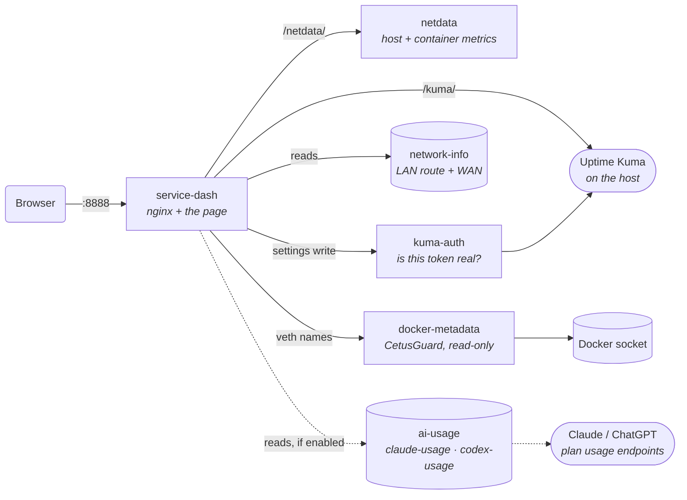

<div align="center">


# Service Dash

**One dashboard for everything you host — each service's local *and* public URL on a single card, next to the live health of the machine running them.**

Open it at home and cards go to your LAN. Open it from a hotel and the same cards go over the internet. Nothing is duplicated, nothing is configured twice.

[](https://github.com/cvaghela/service-dash/actions/workflows/validate.yml)
[](https://github.com/cvaghela/service-dash/releases/latest)
[](LICENSE)
[](https://github.com/cvaghela/service-dash/pkgs/container/service-dash)
[](#requirements)
[](https://cvaghela.github.io/service-dash/demo/)

**[Try the live demo →](https://cvaghela.github.io/service-dash/demo/)** — the real dashboard on sample data. Sign in as `test` / `Test`.

[Quick start](#quick-start) · [Configuration](#configuration) · [How it works](#how-it-works) · [Troubleshooting](#troubleshooting)


</div>

---

## Why

Self-hosting accumulates two problems that no single tool solves.

The first is that monitoring and metrics live apart. Uptime Kuma tells you a service is up; it cannot tell you the box
is at 90% RAM, or which container took it. So you keep two tabs open and correlate by hand.

The second is addresses. Every service ends up with a LAN address and a public one, and every dashboard makes you pick a
side — or you keep one dashboard for home and another for away.

Service Dash puts both on one page and resolves the address problem without asking. It is a single Compose stack: the
dashboard, a bundled Netdata Agent, and a few small sidecars. No build step, no Node.js runtime, no separate Netdata
install. nginx serves the page and proxies everything else, so the browser only ever talks to one origin.

## What it does differently

Most self-hosted dashboards are a grid of links. These four are the reasons this one exists.

### One card, both addresses — and it picks the right one

Both addresses live on the same card, and **✨ Auto** opens whichever one this browser can actually reach — decided per card,
not per dashboard. The active endpoint is tinted, hovering says *why* it chose, and pinning to Local or External is one
click.

It never probes, and it never guesses. Reaching the dashboard at `192.168.1.50` already proves your browser routes to
that network; reaching it at `dash.example.com` proves it does not. The answer is in the address bar before the first
card renders — no timeouts, no failed requests, no waiting. The rule is deliberately one-sided: anything unproven
resolves to External, because opening a public URL from the LAN merely hairpins, while opening a LAN URL from outside is
a dead link.

### The machine, not just the services

Uptime Kuma tells you whether a service is up. It says nothing about what the box is doing, or which container is eating
your RAM.

A Netdata Agent ships **inside the stack** — no separate install, no second port to publish, no third dashboard. You get
CPU with normalised load, RAM, storage and network throughput, plus package power and temperature where the hardware
exposes them. Map a card to one container or several, and an app plus its database, cache and worker are added together
into a single figure on the card.

### What is left of your AI plan

Opt-in, and off until you ask for it. A sidecar signs in to your **Claude** or **ChatGPT** account and reports how much
of each plan you have spent — session, weekly and per-model windows — as dials above the grid and a summary in the
sidebar.

It runs on the host that is always on, which is the whole point: plan usage is account-wide, so a figure measured on
your laptop is wrong the moment you work from your phone. Reading it costs nothing — both providers expose a passive
endpoint, and neither reporter ever spends quota to measure quota.

Each provider is independent. Connect one, both, or neither; a provider you never sign in to simply does not appear.
**Gemini is listed as coming soon** — its usage endpoint is reachable, but signing in to it from a headless container is
not solved yet, so there is nothing to enable rather than a button that goes nowhere.

### Settings that follow you, with no second account

Card icons, container mappings, filters, storage selection and notes are shared by every browser and device — kept on
the server, not in one browser's local storage.

There is no account to create. Reading settings is open; changing anything asks **Uptime Kuma itself** whether your
session is real. You already have that login, so the dashboard does not invent another one.

## Everything else

|  | |
| --- | --- |
| **Live service cards** | Status and uptime for every monitor on your Kuma status page. Search, filter by status or category, click to open. |
| **Real service icons** | Automatic matching against the full [selfh.st](https://github.com/selfhst/icons) catalogue — 2,880 icons and growing — with a live picker per card. No internet? Every card falls back to a monogram drawn in the browser. |
| **Private by default** | Service URLs, the host's own LAN and WAN addresses, and the AI usage panel are all withheld until you sign in, so the dashboard can sit on a screen other people can see. |
| **Behaves like an app on a phone** | No stray pinch-zoom, no double-tap zoom, no lurch when a field takes focus, and content clear of the notch. Taps and saves carry haptic feedback where the browser supports it (Android and Chrome; iOS Safari has no Vibration API). |
| **Built to stay smooth** | Compositing is budgeted deliberately: large surfaces carry no `backdrop-filter`, small ones keep the glass. Worth about 190MB of GPU layer memory on a phone and roughly double the scroll frame rate on desktop. |
| **Offline-tolerant** | Fonts, icons and the icon catalogue all degrade to local fallbacks. Nothing on the page depends on reaching the internet. |
| **No build step** | `index.html`, one stylesheet, one JavaScript file. What ships is what runs; what you read is what executes. |

<div align="center">


</div>

---

## Requirements

- Linux **AMD64 or ARM64** host — the images are published for both from 1.3.3
- **Docker Engine with Compose v2**, running **rootful**
- An **Uptime Kuma** instance on the same host, with its HTTP port published
- Outbound HTTPS and DNS — needed only for WAN-address detection and the icon catalogue

Rootful is not a preference. The bundled Netdata Agent runs with `pid: host`, `SYS_PTRACE` and `SYS_ADMIN`, an
unconfined AppArmor profile and read-only mounts of the host root, `/proc` and `/sys`; the network helper uses host
networking to read the default route. Those are what produce real host metrics, and rootless Docker cannot grant them.
Nothing else in the stack is privileged — the dashboard itself asks for nothing, and the Docker socket goes only to
CetusGuard, restricted to read-only network queries.

<details>
<summary><strong>Platform support</strong></summary>

<br>

| Platform | Support | Why |
| --- | --- | --- |
| ZimaOS on ZimaBoard | **Supported** | The primary target, and where releases are tested |
| CasaOS on Linux AMD64 | **Supported** | Use `docker-compose.casaos.yml`; take it from the release rather than adapting the standard file |
| Debian / Ubuntu AMD64 | **Supported** | Stock Docker Engine, nothing special needed |
| Other Linux AMD64 | Best effort | AppArmor, SELinux or mount policy may need adjusting for the Netdata Agent |
| Synology / QNAP | Best effort | Vendor Docker builds often withhold `pid: host` and the capabilities Netdata needs |
| Linux ARM64 | **Supported** | Images are published `linux/arm64` from 1.3.3. Untested on ARM hardware by the maintainer, so treat first reports as such |
| Docker Desktop (macOS / Windows) | Not supported | Containers would measure Docker's Linux VM, not your machine, so host metrics would be fiction |
| Rootless Docker | Not supported | Cannot grant `pid: host`, `SYS_ADMIN` or the host mounts Netdata needs |
| Podman / Kubernetes | Not supported | The stack is written for Docker Compose; neither is tested |

</details>

---

## Live demo

**[cvaghela.github.io/service-dash/demo](https://cvaghela.github.io/service-dash/demo/)**

The actual `index.html`, `styles.css` and `app.js` this repository ships, with stand-in backends in place of Uptime Kuma,
Netdata and the sidecars. Every number and address is invented; the icons are real, fetched from the same catalogue a
real deployment uses.

Signed out it behaves as it would on a screen anyone can see — service URLs read **URL Locked** and the settings gear is
hidden. **Sign in as `test` / `Test`** (leave 2FA blank) to reveal the addresses and unlock settings. Changes you make
are kept in your own browser and affect nobody else.

## Quick start

**On ZimaOS, skip this** — add the app store source below and install from the UI.

```sh
mkdir -p /opt/service-dash && cd /opt/service-dash
curl -fsSLO https://raw.githubusercontent.com/cvaghela/service-dash/main/docker-compose.yml
docker compose pull && docker compose up -d
```

Open **`http://SERVER-IP:8888`**.

Every release publishes both Compose files as assets — take the one that matches your host.

<details>
<summary><strong>ZimaOS — app store (easiest)</strong></summary>

<br>

Service Dash publishes its own ZimaOS app-store source, so it installs and updates from the ZimaOS UI with no SSH.

1. **App Store → ⋯ → Add Source**, and paste:

   ```
   https://cdn.jsdelivr.net/gh/cvaghela/service-dash@gh-pages/store.json
   ```

   If the store shows an older version than the [latest release](https://github.com/cvaghela/service-dash/releases/latest),
   use the always-fresh mirror instead — jsDelivr can cache a source for up to 12 hours:

   ```
   https://cvaghela.github.io/service-dash/pages/store.json
   ```

2. Open the **Service Dash** source and install the app.
3. Open `http://ZIMAOS-IP:8888`.

Set up **Uptime Kuma** first — Service Dash reads your monitors from it and does not install it for you. Leave Kuma on
port `3001` and note your status page's slug, or change `KUMA_PORT` and `STATUS_SLUG` during install to match.

Later releases appear as an update on the app's tile.

The source is built from [`appstore/`](appstore/) in this repository by IceWhale's official
[build action](https://github.com/IceWhaleTech/build-appstore-action) — see [`appstore/README.md`](appstore/README.md).

</details>

<details>
<summary><strong>ZimaOS — Compose over SSH</strong></summary>

<br>

Enable **SSH Access** from the ZimaOS View menu, then:

```sh
sudo -i
mkdir -p /DATA/AppData/service-dash && cd /DATA/AppData/service-dash
curl -fsSLO https://raw.githubusercontent.com/cvaghela/service-dash/main/docker-compose.yml
export DOCKER_CONFIG=/var/lib/docker/.docker && mkdir -p "$DOCKER_CONFIG"
docker compose pull && docker compose up -d
```

Keep the file in that directory so the stack can be updated later. The `x-casaos` block supplies the ZimaOS tile
metadata; other Compose implementations ignore it.

</details>

<details>
<summary><strong>CasaOS</strong></summary>

<br>

CasaOS needs **`docker-compose.casaos.yml`** — do not import the standard file. Its UI importer does not reliably keep
named volumes or the default network, so the CasaOS file uses explicit `/DATA/AppData/service-dash` bind mounts and a
named bridge network with service aliases.

**App Store → Custom Install → Docker Compose**, paste the file, install, then open `http://CASAOS-IP:8888`.

The ZimaOS store source above will not help here: it is published in ZimaOS's v2 app-store protocol, and CasaOS's
custom-source feature expects the older v1 `main.zip` bundle, which this project does not build.

</details>

<details>
<summary><strong>From a source checkout</strong></summary>

<br>

`install-linux.sh` runs the same deployment plus platform, Compose, Netdata, network and Uptime Kuma checks:

```sh
chmod +x install-linux.sh && ./install-linux.sh
```

</details>

---

## Configuration

Everything is set in the Compose file. There is no `.env`, and **no Uptime Kuma credentials belong in it** — signing in
is a browser-only action.

| Setting | Service | Purpose | Default |
| --- | --- | --- | --- |
| `ports` | service-dash | Host port mapped to container port 80 | `8888:80` |
| `KUMA_PORT` | service-dash | HTTP port Uptime Kuma publishes on this host | `3001` |
| `STATUS_SLUG` | service-dash | Last path segment of your published status-page URL | `homelab` |
| `STORAGE_MOUNT` | service-dash | Initial storage source for a browser with no saved choice | `auto` |
| `KUMA_URL` | kuma-auth | Where the validator reaches Kuma. Must be the same instance as `KUMA_PORT` | `http://host.docker.internal:3001` |
| `NETWORK_INFO_REFRESH_SECONDS` | network-info | Starting value only — the Settings page overrides it | `600` |

`KUMA_PORT` is a port number, not a URL: for `http://SERVER:3010` use `3010`. Kuma must be on the same host — a remote
instance, an HTTPS-only Kuma, or one behind a path prefix is not supported by the current Compose file.

To find your slug, open the published status page in Kuma: a URL ending `/status/homelab` means `STATUS_SLUG: "homelab"`.

After editing Compose, recreate the affected container:

```sh
docker compose up -d --force-recreate service-dash
```

### The Settings page

The gear in the top bar — visible once you are signed in — holds what does **not** need a container recreated:

- **Refresh interval** — how often the LAN route and public IP are re-read, from 30 seconds to 24 hours.
- **Reveal service links on hover** — whether card links stay unreadable until pointed at.
- **Reveal LAN and WAN addresses on hover** — the same, for the host's own addresses.
- **AI usage** — whether the optional Claude reporter is running, connected, or waiting on a sign-in, with the exact
  command for whichever step is next, and a one-click bug report for the one state no command can fix.

These apply to every browser and device. `network-info` reads the interval straight from the shared document and picks
it up on its next pass; if it is missing or out of range it falls back to `NETWORK_INFO_REFRESH_SECONDS`, then 600.

`KUMA_PORT`, `STATUS_SLUG` and `STORAGE_MOUNT` stay in Compose, because the dashboard needs them before it can start.

### AI usage (optional)

Off unless you ask for it, and it stays off if you never do. Nothing about the rest of the dashboard changes.

Two sidecars share one Compose profile: `claude-usage` reads your Claude plan, `codex-usage` reads your ChatGPT plan.
Each writes its own document, and the dashboard merges whatever it finds — so you can connect one, both, or neither, and
a provider you never sign in to simply does not appear.

**What they read, and what they do not.** Each calls one endpoint that returns usage percentages and reset times. No
prompt, conversation, project or file is visible to either. The Codex endpoint also returns your email, user id and
account id; **those are never copied into the document the dashboard serves**, and there is a test asserting it. That
document has no authentication in front of it, so anything written there is readable by anyone who can reach your
dashboard — only the plan name and the window figures cross over.

**Turning it on.**

```bash
# 1. Add the reporters. Finds your Compose file wherever it lives.
sudo docker compose -f "$(sudo docker inspect service-dash --format '{{index .Config.Labels "com.docker.compose.project.config_files"}}')" up -d

# 2. Sign in once, to whichever you use. Both CLIs are inside their containers.
sudo docker exec -it service-dash-claude-usage claude auth login
sudo docker exec -it service-dash-codex-usage codex login --device-auth
```

Run these from any folder. Neither asks you to remember where your Compose file lives — the first asks Docker, which
stamped that path onto the dashboard's own container when it created it — and neither needs anything installed on the
host beyond Docker.

Two details that are not decoration. `sudo`, because CasaOS writes its Compose file `0600 root:root` and its users are
not in the `docker` group by default; drop it if your host does not need it. And `--device-auth` for Codex, because its
normal login opens a browser at the container's own localhost, which nothing outside can reach — and it fails by
*hanging* rather than by saying so.

You should not need this page again: **Settings → AI usage** shows each provider's state and hands you whichever command
comes next, including a **Sign out** control once connected. Each login lives in its own volume, so `docker compose
pull` does not sign you out.

**Why a sidecar and not the browser.** Plan usage is account-wide. A figure measured in a browser tab only reflects
what *that* machine did — work from your phone for an afternoon and it is quietly wrong. A reporter on the host that is
always on sees the real total regardless of what you were typing on.

**How it behaves.** Both poll every five minutes (`CLAUDE_USAGE_REFRESH_SECONDS`, `CODEX_USAGE_REFRESH_SECONDS`); plan
windows move slowly and polling harder buys nothing. Reading costs no quota — both endpoints are passive.

A failed poll never throws away a good reading. Only a 401 or 403 counts as a login problem; a timeout, a 5xx or a
moment without internet leaves the last figures in place and lets the timestamp age — dimming at fifteen minutes, giving
up at an hour. In practice *Sign-in needed* should not reappear after the first time: the token is refreshed on every
poll, so the login stays warm until you sign out, revoke the session, change your password, or leave the container off
long enough for the refresh token itself to lapse.

The panel is hidden until you sign in to Uptime Kuma, alongside the service URLs and the LAN and WAN addresses — how
much of your plan you have spent is nobody else's business when this is on a wall. Like those, it is a screen-level
control: the underlying documents stay readable by anyone who can reach the dashboard, the same as
`/network-info/status`.

**Two honest caveats.** Neither endpoint is part of a documented public API, so either provider can change one without
notice. When that happens the panel disappears rather than showing a stale number, Settings explains why, and offers a
**Report this on GitHub** button that opens a prefilled issue listing the field names the reporter did not recognise —
no usage figures, no account details, no part of your login. It opens GitHub's issue *form*; you read it and decide
whether to file it.

And both images carry a vendor CLI, which makes them substantially larger than the other sidecars. That, and the fact
that they hold a real login, is exactly why they sit behind a profile instead of starting for everyone.

### Shared settings and sign-in

Card settings, filters, storage and network selections and the notes panel are shared by every browser and device.
There is nothing to switch on and no password to set: **reading is open; saving requires being signed in to Uptime
Kuma.**

nginx cannot verify a Kuma token, and a browser claiming to be signed in proves nothing, so the question is put to Kuma
itself. The `kuma-auth` sidecar emits Kuma's `loginByToken`, which checks the token against Kuma's own secret, confirms
the user is still active, and rejects tokens issued before a password change. Anything that is not an explicit yes is a
no — including a timeout. The token stays in the browser that signed in and is never written into the shared document.

<details>
<summary><strong>What that means in practice</strong></summary>

<br>

- Anyone who can reach the dashboard can **read** the settings, as they can already read the dashboard.
- Anyone who can sign in to your Uptime Kuma can **change** them for everyone. Kuma's user list is the guest list.
- **Last write wins** — no merge, no locking. Changes elsewhere appear on reload, not live.
- If `kuma-auth` is down the shared document becomes unavailable **including reads**: nginx checks every request to it
  and cannot be made to check only writes. Each browser falls back to its own copy and the dashboard keeps working.
- The document is capped at 256 KB. A failed write leaves that browser on its own copy with one warning.

</details>

### What signing in reveals

Signed out, service links and the host's LAN and WAN addresses read **URL Locked** and **IP Locked**. Those values are
never requested, so they do not reach the browser at all.

Signed in, they are shown — by default staying unreadable until you point at one or tab to it, so the dashboard can sit
on a visible screen. Both covers can be turned off in Settings. The Settings gear is hidden while signed out, and notes
are locked the same way.

---

## Using the dashboard

**Service cards** show each service's two endpoints, Local and External, on the same card. The one a click will open is
tinted. A service with only one endpoint shows one row.

The pairing comes from Uptime Kuma itself: two monitors named `Plex` and `Plex local` — also `Plex (local)`,
`Plex - local` or `Plex.local` — are recognised as one service with two addresses. Nothing to configure here; name the
monitors that way in Kuma and the card builds itself.

### Which address a click opens

The switch in the top bar has three positions. Press <kbd>L</kbd> to cycle them.

| | |
| --- | --- |
| ✨ **Auto** | Each card opens whichever address this browser can reach. The default on a new install. |
| 🏠 **Local** | Always the LAN address. |
| 🌐 **External** | Always the public one. |

**Auto reads the answer off the address bar, because the address bar already knows it.** If you loaded the dashboard
from `http://192.168.1.50:8888`, your browser has *proved* it can route to that network — so a service at
`192.168.1.9` is reachable by construction. Nothing is tested, which is the point: probing a dead LAN address costs a
TCP timeout on every card, and the dashboard's own `connect-src 'self'` policy forbids the request anyway.

The two possible mistakes do not cost the same, so the rule is deliberately one-sided. Opening the public URL from your
own sofa still works — the traffic just leaves the house and comes back. Opening a LAN address from a café is a dead
link. **Local is only chosen on evidence.** Anything unproven — a Tailscale or carrier-NAT address, a hostname it does
not recognise — resolves to public.

Three details sharpen it further:

- A monitor named `…local` whose URL is really a public name is not a LAN shortcut, so the public address is used
  instead. The suffix is a label you typed; the address is the fact.
- If Kuma reports the LAN monitor down and the public one up, the public one wins.
- A card with only one address opens that one, in every mode.

Hover any card and it tells you what it decided and why — *"auto, because 192.168.1.50 is a LAN address"*. A switch
that guesses silently is worse than the manual one it replaces.

**Overrides are remembered against the address you set them at.** Pin Local at home and you will not find it still
pinned — and broken — when you open `dash.example.com` from a train later. That address gets its own answer.

> **Upgrading?** Nothing changes on its own. A saved Local or External preference is kept exactly as it was, on every
> device that shares your settings. Auto is one click away when you want it.

**Card settings** — hover a card, click the pencil on its icon:

- **Icon** — type a service name to search the full selfh.st catalogue, or paste an image link. **Default icon**
  restores the automatic match; clearing the field shows a monogram.
- **Mapped to** — which containers' CPU and RAM the card shows. Kuma monitor names and container names rarely agree, so
  most cards need pointing at their container once. Map several and their figures are added together, with the tooltip
  naming what was combined. A container that stops reporting is left out rather than counted as zero.

**Host metrics** come from the bundled Netdata Agent: CPU utilisation with normalised 1-minute load (`32% (1.28 / 4)`),
RAM, storage with used/free/total, and network throughput. Package power and temperature appear where the host exposes
Intel RAPL and sensor feeds; missing optional sensors show `—` rather than invented values.

<details>
<summary><strong>Storage sources</strong></summary>

<br>

Auto-detection prefers named data disks — `/media/…`, `/DATA`, CasaOS data storage, `/mnt`, then `/` — and excludes boot
partitions, container overlays and transient system mounts. Open the Storage card's **Sources** dropdown to pick one or
several; multiple selections are converted to bytes and aggregated. Take care not to select two paths backed by the same
filesystem, or it is counted twice. The choice is saved per browser and beats `STORAGE_MOUNT`.

`STORAGE_MOUNT` takes `auto` or one exact mount path — a `chart_labels.mount_point` value such as `/DATA`, not a chart
id such as `disk_space./`. To list what Netdata reports:

```sh
curl -fsSL http://127.0.0.1:8888/netdata/api/v1/charts \
  | jq -r '.charts | to_entries[] | select(.key | startswith("disk_space.")) | .value.chart_labels.mount_point // empty' \
  | sort -u
```

A browser that already saved a selection keeps it. To clear just that choice:

```js
localStorage.removeItem("storageMounts"); location.reload();
```

</details>

---

## How it works

Five services on one private network, plus two optional reporters. Only the dashboard publishes a port.



| Service | Role |
| --- | --- |
| `service-dash` | nginx serving the page and proxying `/kuma/`, `/netdata/` and `/icon-index` |
| `netdata` | Bundled Agent for host and per-container metrics. Port 19999 is **not** published |
| `kuma-auth` | Asks Kuma whether a browser's token is real, so nginx can allow a settings write |
| `network-info` | Reads the host's default route and looks up the WAN address |
| `docker-metadata` | CetusGuard, allowing only read-only Docker **network** queries |
| `claude-usage` | Reads your Claude plan's usage limits and nothing else. Idle until you sign in |
| `codex-usage` | Reads your ChatGPT plan's Codex usage limits and nothing else. Idle until you sign in |

**LAN** comes from the host's actual default route, not the browser's address. `network-info` runs with host networking,
reads the route directly, and writes the address, prefix, interface and gateway to a private volume the dashboard mounts
read-only. It publishes no port and needs neither host PID visibility nor `SYS_ADMIN`.

**WAN** is looked up server-side via `api.ipify.org`, with Cloudflare trace as a fallback. Those providers see the
host's public IP and nothing else — no browser identifiers, no dashboard or Kuma data.

**Docker names.** CetusGuard is the only service with the Docker socket, and its allowlist permits read-only network
listing and inspection alone. Container creation, exec, logs and secrets stay blocked. It exists so `veth` interface
names can be shown as container names.

**AI usage.** The two reporters run always and do nothing until you sign in. They can hold real logins, so it is
worth being precise about what that buys. Each calls one endpoint returning usage percentages and reset times; neither reads
conversations, projects or files. Neither publishes a port, and each writes only to its own status document — the login
itself never appears there, and nothing leaves the host except the request to the provider.

They run as root with `no-new-privileges`, like the other sidecars, and for the same reason: on ZimaOS/CasaOS their
volumes are host bind mounts, which do not inherit ownership from the image the way named volumes do, so an
unprivileged user cannot write its own status file or its own login.

Do not start this profile if you would rather no container on the box could speak for your Claude or ChatGPT account.

---

## Security

The dashboard is not authenticated. Keep it on a trusted network, or put an authenticated HTTPS reverse proxy in front
of it. If you do, proxy the whole origin — do not separately remap `/kuma` and `/netdata` — and preserve WebSocket
upgrade headers so the Kuma login works.

Responses carry a Content-Security-Policy, `X-Content-Type-Options: nosniff` and `Referrer-Policy: no-referrer`. The
policy allows scripts and styles from the dashboard, fonts from Google Fonts, and images from the dashboard, `data:`
URIs and **HTTPS** hosts only. That last part is deliberate: a plain-`http` image URL cannot load, which stops a hostile
icon link making requests to LAN equipment from every viewer's browser. Self-hosted icons work over a relative path such
as `/icons/plex.png`; one served over plain `http` does not.

Also worth doing:

- Use HTTPS wherever the dashboard is reachable outside a trusted LAN.
- Do not publish Uptime Kuma or Netdata admin interfaces unnecessarily.
- On a shared device, use the dashboard's logout and clear site data — "remember me" stores a Kuma token in that browser.

Found a security problem? Please open a [security advisory](https://github.com/cvaghela/service-dash/security/advisories/new)
rather than a public issue.

---

## Troubleshooting

<details>
<summary><strong>Dashboard does not open</strong></summary>

<br>

`docker compose ps` and `docker compose logs service-dash`. Check the host port is free and that
`http://SERVER:PORT/healthz` returns `ok`.

</details>

<details>
<summary><strong>502 for <code>/kuma/</code></strong></summary>

<br>

The dashboard cannot reach Kuma. Check `KUMA_PORT` and that Kuma publishes that port on this host.

</details>

<details>
<summary><strong>Status cards do not load</strong></summary>

<br>

Open `http://SERVER:PORT/kuma/api/status-page/YOUR_SLUG`. `Status Page Not Found` means `STATUS_SLUG` is wrong.

</details>

<details>
<summary><strong>Storage shows only <code>/</code></strong></summary>

<br>

Netdata can only report mounts it can see. Check what it found:

```sh
curl -s localhost:19999/api/v1/charts | grep -o '"disk_space\.[^"]*"' | sort -u
```

One entry means the Netdata container is not being given the host root. Both Compose files here bind
`/:/host/root:ro,rslave` for exactly this reason. An older CasaOS stack may bind only `/DATA`, which is not enough for
Netdata to walk the host's mount table — replace that line and run `docker compose up -d --force-recreate netdata`.

</details>

<details>
<summary><strong>Metrics missing or wrong</strong></summary>

<br>

`docker compose logs netdata`, then open `http://SERVER:PORT/netdata/api/v1/charts`. CPU watts and temperature are
optional and do not count against the `REALTIME x/5` indicator; look for `cpu.powercap_intel_rapl_zone` and
`system.hw.sensor.temperature.input`.

</details>

<details>
<summary><strong>LAN or WAN unavailable</strong></summary>

<br>

`docker compose logs network-info`, then:

```sh
docker compose exec -T service-dash wget -q -O - http://127.0.0.1/network-info/status
```

WAN needs outbound HTTPS and DNS. The dashboard deliberately never substitutes the browser's URL for a missing LAN
address.

</details>

<details>
<summary><strong>Login or private URLs fail</strong></summary>

<br>

Check `/kuma/socket.io/socket.io.js` loads, that any outer proxy allows WebSockets, and that browser blockers are not
blocking Socket.IO.

</details>

<details>
<summary><strong>Changes do not appear</strong></summary>

<br>

Assets are cached for seven days:

```sh
docker compose pull && docker compose up -d --force-recreate
```

Then hard-refresh the browser.

</details>

---

## Updating

The current release is **1.5.1**; the Compose files in this repository reference the matching `1.5.1` images.

Most releases are drop-in:

```sh
docker compose pull && docker compose up -d
```

Some change the Compose file, and an image pull cannot carry that. Each release's notes say so explicitly, and both
Compose files ship as release assets so you can take the correct one.

**Installed from the ZimaOS app store?** Updates arrive on the app's tile — the store entry is republished with each
release, and ZimaOS compares its version against what you have. A release that changes the Compose file changes it
there too, so there is nothing to hand-edit; check the release notes for anything that needs a setting changed at
install time.

### Upgrading from 1.4.2

**The Compose file changed, so an image pull alone will not carry it.** On a standard host, take
`docker-compose.yml` from the release page.

**On CasaOS/ZimaOS, updating the app is not enough.** A CasaOS app update rewrites the **image tags** in its managed
Compose file and leaves the service list alone, so an install updated to 1.5.0 runs the new images without ever gaining
`claude-usage` or `codex-usage`.

**Check which case you are in — run the enable command and read what it says.** If the output lists
`service-dash-claude-usage` among the containers, you are done; skip to the sign-in. If it lists only the five existing
containers as `Running`, your Compose file has no reporters in it and you need the overlay below. That check takes a
second and is reliable whichever way your install got here.

```bash
sudo curl -fsSL -o /DATA/AppData/service-dash/ai-usage.override.yml \
  https://raw.githubusercontent.com/cvaghela/service-dash/main/docs/ai-usage.override.yml

sudo docker compose \
  -f "$(sudo docker inspect service-dash --format '{{index .Config.Labels "com.docker.compose.project.config_files"}}')" \
  -f /DATA/AppData/service-dash/ai-usage.override.yml \
  up -d
```

The dashboard container is recreated, because it needs a read-only mount to see what the reporters write. The overlay
is harmless if your file already defines the services — Compose merges it and nothing changes — so when in doubt, use
it.

> **A note on fresh installs.** The store entry does define both services, and CasaOS copies a store app's service list
> faithfully on install, so a fresh install *should* include them without the overlay. That path has not been tested end
> to end, so it is written here as an expectation rather than a promise — use the check above, which does not depend on
> it being true.

Nothing breaks if you do not. The new services are optional and sit behind a Compose profile, so an existing deployment
that only pulls images keeps working exactly as before; it simply will not offer the AI usage panel. The dashboard
serves the panel's route as a 404 when the reporters are absent, which it reads as "not enabled".

What the new file adds:

- Two services, `claude-usage` and `codex-usage`. They run from the start and stay idle until you sign in — with no
  credential each writes an honest "nobody has signed in yet" document, the panel stays hidden, and together they cost
  about 12MB of RAM and no measurable CPU
- The volumes they need: a shared status volume, plus one per provider for its login
- A read-only mount of that status volume on the dashboard, so it can serve what they write

If you never sign in, the reporters sit idle and nothing about your deployment changes.

### Upgrading from 1.3.1

**CasaOS and ZimaOS: one line has to change, or your storage picker keeps showing a single `/`.** Netdata's disk
collector walks the host's mount table and needs the host root bound into its container. The CasaOS Compose file bound
only `/DATA`, so the collector fell back to reporting the container's own root — the picker was faithfully showing the
one mount Netdata claimed existed. Under the `netdata` service's `volumes`, replace:

```yaml
- /DATA:/host/root/DATA:ro,rslave
```

with:

```yaml
- /:/host/root:ro,rslave
```

Then recreate that container — a restart is not enough, because a running container cannot gain a bind mount:

```sh
docker compose -f docker-compose.casaos.yml up -d --force-recreate netdata
```

Taking `docker-compose.casaos.yml` from this release does the same thing. The standard `docker-compose.yml` was never
affected and needs no edit.

Everything else in 1.3.2 arrives with the images:

```sh
docker compose pull && docker compose up -d
```

| Release | What had to change |
| --- | --- |
| 1.2.1 | Added the `kuma-auth` service and `KUMA_URL`, mounted `settings` into `network-info`, and dropped several environment variables that had been added one release earlier — see the [changelog](CHANGELOG.md) if you are coming from 1.2.0 |
| 1.2.2 | CasaOS only: `kuma-auth` had to move onto `service-dash-network`, or the stack could not start |
| 1.3.2 | CasaOS only: Netdata needs `/:/host/root:ro,rslave` instead of `/DATA`, or storage reports one mount |

To roll back, take the previous release's Compose file and run the same commands. Preferences and remembered tokens live
in each browser; Netdata data lives in named volumes, or under `/DATA/AppData/service-dash/netdata` on CasaOS.

Full history is in [CHANGELOG.md](CHANGELOG.md).

---

## Contributing

Issues and pull requests are welcome. There is no build step for the frontend — `index.html`, `assets/css/styles.css`
and `assets/js/app.js` are what the browser runs, so a change is a file edit and a container recreate.

```sh
# Build the Service Dash images from source
docker compose -f docker-compose.yml -f docker-compose.build.yml up -d --build

# The AI reporters are much larger than the rest; build them only when needed
docker compose -f docker-compose.yml -f docker-compose.build.yml build claude-usage codex-usage

# The checks CI runs
docker compose -f docker-compose.yml config --quiet
docker compose -f docker-compose.casaos.yml config --quiet
docker compose -f appstore/Apps/ServiceDash/docker-compose.yml config --quiet
python3 scripts/check-compose-networks.py   # every nginx upstream is reachable
python3 scripts/check-release.py            # one version, stated the same everywhere
python3 scripts/check-service-additions.py  # a new service must come with an upgrade path
sh -n entrypoint.sh network-info.sh claude-usage.sh codex-usage.sh
node --check assets/js/app.js
```

```sh
# Render the official-store variant of the app entry and read the diff
python3 scripts/sync-appstore-upstream.py --check
```

Both scripts cover all three Compose files. The third is the ZimaOS app-store entry in [`appstore/`](appstore/) — same
stack, so it can break the same ways; see [`appstore/README.md`](appstore/README.md).

[CLAUDE.md](CLAUDE.md) documents the release process and the conventions this codebase follows — including why those
checks exist.

## Built with

[Uptime Kuma](https://github.com/louislam/uptime-kuma) · [Netdata](https://github.com/netdata/netdata) ·
[CetusGuard](https://github.com/hectorm/cetusguard) · [selfh.st/icons](https://github.com/selfhst/icons) ·
[nginx](https://nginx.org/)

## License

Copyright © 2026 Chintan Vaghela.

[GNU General Public License v3.0](LICENSE) or, at your option, any later version. You may run, study, modify and
redistribute it; if you distribute a modified version, your changes must be released under the GPLv3 too. Running a
modified copy on your own server is not distribution.

**Attribution — additional term under GPLv3 §7(b).** The dashboard displays an attribution under **Settings → About**,
and every source file carries a copyright header. Both are Appropriate Legal Notices: if you distribute this work or a modified
version, you must keep them. You are free to add your own alongside. This is the one additional term, and §7 permits it
expressly — it does not restrict your other freedoms under the licence, and it is not an advertising clause: nothing
obliges you to mention this project in your own materials.

Distributed WITHOUT ANY WARRANTY — see sections 15 and 16 of the license.
